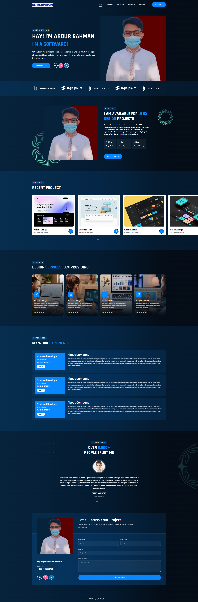

### portfolio website design

This is a personal portfolio website design. It is a responsive website design. It is a simple website design. It is a single page website design. It is a static website design. It is a portfolio website design. It is a website design. It is a website design using HTML, CSS, JavaScript, Bootstrap, jQuery, and Font Awesome. It is a website design using HTML, CSS, JavaScript, Bootstrap, jQuery, and Font Awesome. It is a website design using HTML, CSS, JavaScript, Bootstrap, jQuery, and Font Awesome. It is a website design using HTML, CSS, JavaScript, Bootstrap, jQuery, and Font Awesome. It is a website design using HTML, CSS, JavaScript, Bootstrap, jQuery, and Font Awesome. It is a website design using HTML, CSS, JavaScript, Bootstrap, jQuery, and Font Awesome. It is a website design using HTML, CSS, JavaScript, Bootstrap, jQuery, and Font Awesome. It is a website design using HTML, CSS, JavaScript, Bootstrap, jQuery, and Font Awesome.

### view project

